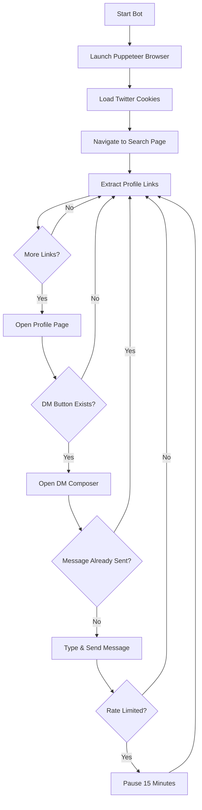

## Architecture Overview

The Twitter DM bot uses browser automation to replicate the manual workflow of sending direct messages. It operates without requiring Twitter API access by using your session cookies and automating interactions with the Twitter web interface.

## Browser Automation with Puppeteer

The bot leverages **Puppeteer Extra** with the **Stealth Plugin** to avoid detection:

```typescript
import puppeteer from "puppeteer-extra";
const StealthPlugin = require("puppeteer-extra-plugin-stealth");
puppeteer.use(StealthPlugin());
```

### Launch Configuration

The browser is launched with specific arguments to mimic a real user:

```typescript
const args = [
    "--no-sandbox",
    "--disable-setuid-sandbox",
    "--disable-infobars",
    "--window-position=0,0",
    "--ignore-certifcate-errors",
    "--ignore-certifcate-errors-spki-list",
    '--user-agent="Mozilla/5.0 (Macintosh; Intel Mac OS X 10_12_6) AppleWebKit/537.36 (KHTML, like Gecko) Chrome/65.0.3312.0 Safari/537.36"',
];

const browser = await puppeteer.launch({
    ...args,
    headless: false,  // Visible browser window
});
```

<Info>
The stealth plugin (from `puppeteer-extra-plugin-stealth` in package.json) helps bypass bot detection by removing common automation signatures.
</Info>

## Authentication Flow

The bot uses your exported Twitter cookies for authentication:

```typescript
let cookies = await readFile("cookies.json", { encoding: "utf8" });
let cookieJson: Protocol.Network.CookieParam[] = JSON.parse(cookies);
await page.setCookie(...cookieJson);
```

This maintains your logged-in session without requiring credentials.

## Search Page Navigation

The bot constructs a Twitter search URL with your configured query:

```typescript
await page.goto(
    `https://twitter.com/search?q=${config.searchQuery}&src=recent_search_click&f=live`
);
```

**URL Structure:**
- Base: `https://twitter.com/search`
- `q=` - Your search query (e.g., "vancouver" or a hashtag)
- `src=recent_search_click` - Source parameter
- `f=live` - Filter for live/latest tweets

## Profile Link Detection Algorithm

The bot uses a sophisticated async iterator to continuously discover new profile links:

### Regex Pattern Matching

```typescript
let profilePageLinkRegEx = /^\/[0-9A-Za-z]+$/;
```

This regex matches Twitter profile URLs in the format `/username`.

### Link Extraction Logic

```typescript
let profileLinkFinderScriptResult = await page.evaluate(() => {
    let newProfileLinks: string[] = [];
    let profilePageLinkRegEx = /^\/[0-9A-Za-z]+$/;
    
    // Find all links in the main feed column
    let allElementsWithLinks = document.querySelectorAll(
        "div[data-testid='primaryColumn'] a[role='link']"
    );
    
    allElementsWithLinks.forEach((elem, index) => {
        let profileLink = elem.getAttribute("href");
        
        if (profileLink?.match(profilePageLinkRegEx)) {
            // Exclude Twitter's default navigation links
            if (!(
                profileLink == "/home" ||
                profileLink == "/explore" ||
                profileLink == "/notifications" ||
                profileLink == "/messages"
            )) {
                newProfileLinks.push("https://twitter.com" + profileLink);
            }
        }
    });
    
    // Auto-scroll to load more results
    allElementsWithLinks[allElementsWithLinks.length - 1].scrollIntoView();
    
    return newProfileLinks;
});
```

<Note>
The algorithm automatically scrolls to the last link element to trigger Twitter's infinite scroll, continuously loading new search results.
</Note>

## DM Sending Workflow

For each unique profile link discovered, the bot executes this workflow:

<Steps>
  <Step title="Open Profile Page">
    ```typescript
    let profilePage = await browser.newPage();
    await profilePage.goto(link);
    visitedUrls.add(link);  // Track visited profiles
    ```
  </Step>
  
  <Step title="Locate Message Button">
    ```typescript
    let msgBtn = await profilePage.waitForSelector(
        "div[data-testid='sendDMFromProfile']",
        { timeout: 5000 }
    );
    await msgBtn!.click();
    ```
    
    If the button doesn't appear within 5 seconds (user has DMs disabled), the profile is skipped.
  </Step>
  
  <Step title="Open Message Composer">
    ```typescript
    let msgPage = await browser.newPage();
    await msgPage.goto(profilePage.url());
    ```
  </Step>
  
  <Step title="Check for Duplicate Messages">
    ```typescript
    let elem = await msgPage.waitForSelector(
        `div[data-testid='DmScrollerContainer'] >>> span ::-p-text(${config.message})`,
        { timeout: 10000 }
    );
    // If found, skip this profile
    ```
    
    This searches the DM history for your exact message text.
  </Step>
  
  <Step title="Type and Send Message">
    ```typescript
    let msgBox = await msgPage.waitForSelector(
        "div.public-DraftStyleDefault-block",
        { timeout: 5000 }
    );
    await msgBox?.click();
    await msgBox?.type(config.message);
    
    let sendBtn = await msgPage.waitForSelector(
        "div[data-testid='dmComposerSendButton']"
    );
    await sendBtn?.click();
    console.log("Message sent");
    ```
  </Step>
  
  <Step title="Verify Send Status">
    After clicking send, the bot waits for network idle and then checks for errors.
  </Step>
</Steps>

## Duplicate Message Prevention

The bot implements two layers of duplicate prevention:

### 1. Session-Level Tracking

```typescript
let visitedUrls: Set<string> = new Set();

// Before processing each link
if(visitedUrls.has(link)){
    continue;  // Skip already visited profiles
}
visitedUrls.add(link);
```

### 2. Message History Checking

```typescript
try {
    let elem = await msgPage.waitForSelector(
        `div[data-testid='DmScrollerContainer'] >>> span ::-p-text(${config.message})`,
        { timeout: 10000 }
    );
    // Message already exists in conversation
    msgPage.close().then(() => {
        profilePage.close()
    })
    continue innerloop;  // Skip to next profile
} catch (err) {
    // Message not found, proceed to send
}
```

<Warning>
The `visitedUrls` set only persists during the current bot session. Restarting the bot will clear this memory, though the message history check still prevents true duplicates.
</Warning>

## Rate Limit Detection

After sending each message, the bot checks for Twitter's rate limit error:

```typescript
msgPage.waitForNetworkIdle().then(async () => {
    try{
        let errMsgElem = await msgPage.waitForSelector(
            `div[data-testid='DmScrollerContainer'] >>> span ::-p-text(Message failed to send)`,
            { timeout: 2000 }
        );
        
        // Rate limit detected - pause for 15 minutes
        await new Promise((resolve) => {
            console.log("Script paused for 15 minutes")
            setTimeout(() => resolve(true), 1000 * 15 * 60);
        })
    } catch(err) {
        // No error message found - send was successful
    } finally {
        await msgPage.close();
        await profilePage.close();
    }
});
```

**Detection Method:**
- Wait for network to be idle (message send attempt complete)
- Search for "Message failed to send" text in the DM container
- If found, pause execution for 15 minutes (900,000 milliseconds)
- If not found within 2 seconds, assume success and continue

<Tip>
The 15-minute pause allows Twitter's rate limit window to reset. This is a hardcoded value that may need adjustment based on Twitter's current rate limiting policies.
</Tip>

## Complete Technical Flow



## Key Dependencies

From package.json:

- **puppeteer** (v19.11.0) - Core browser automation
- **puppeteer-extra** (v3.3.6) - Plugin framework
- **puppeteer-extra-plugin-stealth** (v2.11.2) - Anti-detection measures
- **@types/node** (v18.16.0) - TypeScript type definitions

<Info>
The bot uses `tsx watch` for development, which provides automatic reloading when source files change.
</Info>